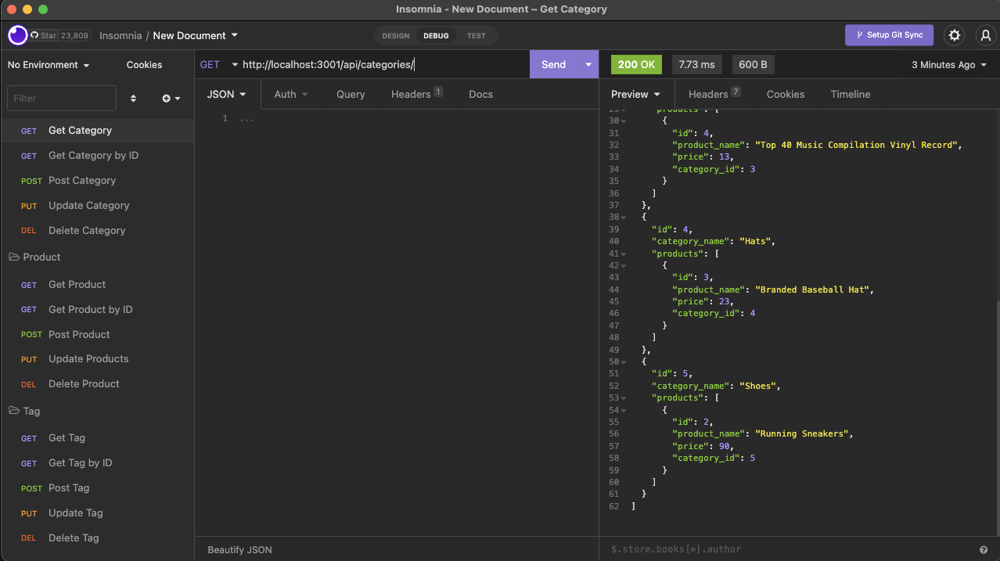

# E-Commerce_Back_End_Module_13_Qi_Chen
 

 ## Technology Used
* Node JS
* Express
* npm
* SQL
* Sequelize

## Description
* Customer can generate the Product, Tag, and Category table to view
* Customer can generate the Product, Tag, and Category table to view by ID
* Customer can add the Product, Tag, and Category 
* Customer can update the Product, Tag, and Category 
* Customer can remove the Product, Tag, and Category 

## Setup/Installation
* Clone this repo to your local
* Run npm install
* Go to db directory
* Run mysql and source schema.sql
* Go to the seeds directory and run node seeds.js
* Go to top level directory and run node server.js
* Using insomnia to run the Get/Post/Put/Delete command to modify the table

## Known Bugs
N/A

## License
MIT 
Copyright(c) 2022 Qi Chen

## User Story
* AS A manager at an internet retail company
* I WANT a back end for my e-commerce website that uses the latest technologies
* SO THAT my company can compete with other e-commerce companies

## Acceptance Criteria
* GIVEN a functional Express.js API
* WHEN I add my database name, MySQL username, and MySQL password to an environment variable file
* THEN I am able to connect to a database using Sequelize
* WHEN I enter schema and seed commands
* THEN a development database is created and is seeded with test data
* WHEN I enter the command to invoke the application
* THEN my server is started and the Sequelize models are synced to the MySQL database
* WHEN I open API GET routes in Insomnia Core for categories, products, or tags
* THEN the data for each of these routes is displayed in a formatted JSON
* WHEN I test API POST, PUT, and DELETE routes in Insomnia Core
* THEN I am able to successfully create, update, and delete data in my database

https://github.com/ricky8221/E-Commerce_Back_End_Module_13_Qi_Chen
